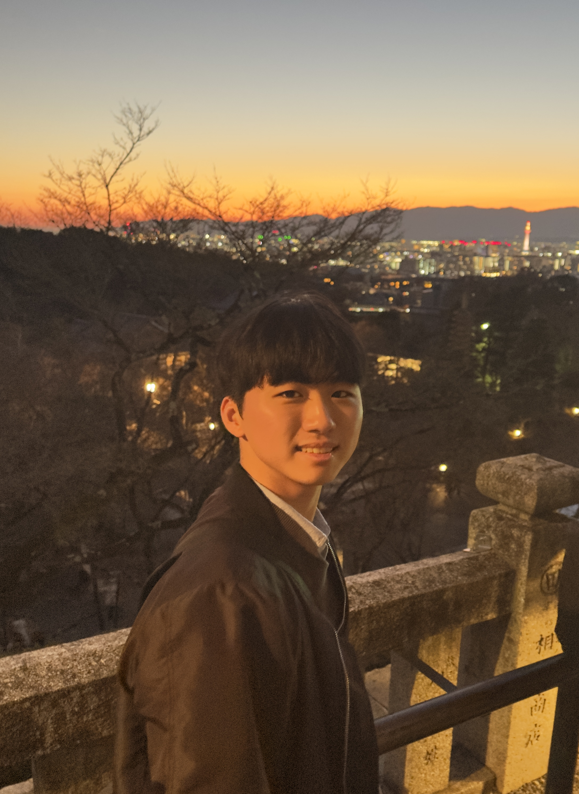

본인을 대표하는 이미지 한 장을 첨부해 주세요.

🎉 축하합니다, 강민석님! 수상의 영광을 함께 나누게 되어 기쁩니다. 🎉

## 🎙️ 우승의 기쁨을 맛본 소감을 한마디로 표현해 주세요.

- 날아가요.

## 🎙️ 팀의 이야기를 들려주세요.

- 처음에 에타에서 해커톤 팀원을 모집하기에 재밌어보여 들어가면서부터 시작하게 되었습니다.
- "농부들"이라는 팀명은 아이들을 미래에 성장할 새싹이니 이들을 돕는 농부라고 생각해서 지었습니다.
- 알던 사람들이 아니라 인터넷에서 알게되었지만, 해커톤을 진행하면서 여러 일을 겪으면서 돈독해져서 더 의미 있는 해커톤이 되지 않았나 싶습니다.

## 🎙️ 여러분을 돋보이게 한 특별한 점은 무엇인가요?

- 발표. 학교 홍보대사 힘.

## 🎙️ 이번 성과의 비결은 무엇이라고 생각하시나요?

- 팀워크: 다른 프로젝트나 해커톤 경험해봤는데, 이렇게까지 잘 맞는 팀을 만난 적이 없었습니다. 팀원분들이 너무 배려심이 깊어서 좋았어요...
- 개발: 다들 자신이 맡은 분야에 대해 어느정도 경험이 있는 분들이어서 인공지능이라던지, 프론트라던지 척척 만드시는 부분이 참 든든했습니다.
- 발표: 저희 아이디어가 아무리 좋고 개발을 잘했더라도, 이를 심사위원분들께 제대로 전하지 못하면 말짱도루묵인데 저희 PM님이 또 발표를 기깔나게 하신게 또 이 성과의 비결이라고 생각합니다.

## 🎙️ 대회 기간 중 특별히 기억에 남는 순간이 있다면 공유해 주세요.

- 두가지가 있는데 첫번쨰는 gemini가 갑자기 안됐을 때에요. api가 토큰 제한에 걸려서 갑자기 작동을 안하길래 거의 30분 동안 헤맸을 때 참... 힘들었습니다.
- 발표 10분 전에 backend server가 터졌을 때 진짜 당황했습니다. 진짜 머리가 아팠지만 터지기 이전 버전으로 겨우 돌려서 살려냈습니다.
- 결선 진출 시점이었던 것 같아요. 저는 아예 결선 진출도 안될 줄 알고, 저는 금요일날 오후에 페스티벌 놀러가기로 했었어요. 12시쯤에 점심 먹고 부스들 구경하고 있었는데 갑자기 저희 팀이 결선 진출한다고 했을 때 너무 도파민이 돌았습니다.

## 🎙️ 데이터 분석이나 학습 과정에서의 나만의 비법이 있다면요?

- 일단 머리부터 박고 들어갑시다. 하면 되더라,,,

## 🎙️ 수상을 기념하여 빌 수 있는 한 가지 소원이 있다면?

- 이 아이템을 더 디벨롭할 생각인데, 나중에는 이게 실제로 언어발달장애를 겪고 있는 아동들, 학부모들에게 도움이 되었으면 합니다.

## 🎙️ 앞으로의 목표와 꿈을 말씀해 주세요.

- 목표이자 꿈이라고 하면 사회에 공헌할 수 있는 서비스를 제 손으로 만드는 것입니다.
