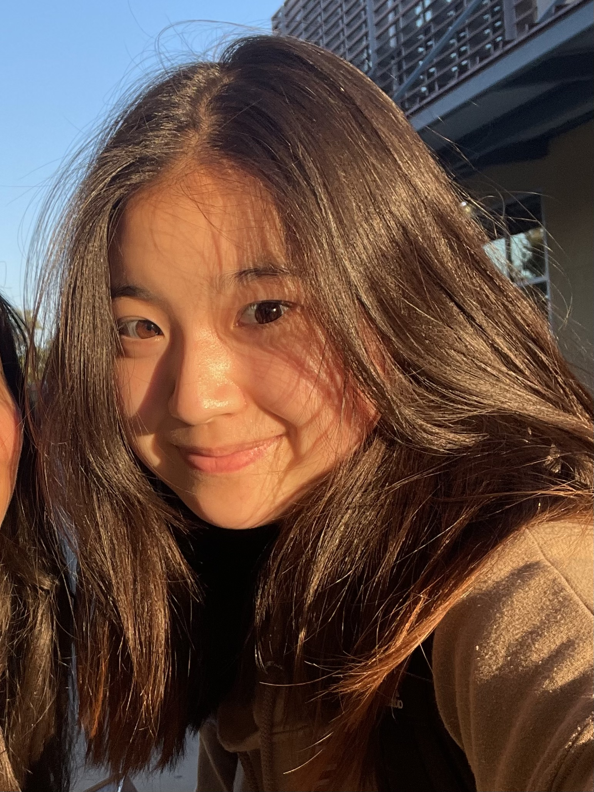

본인을 대표하는 이미지 한 장을 첨부해 주세요.

🎉 축하합니다, 박연우님! 수상의 영광을 함께 나누게 되어 기쁩니다. 🎉

## 🎙️ 우승의 기쁨을 맛본 소감을 한마디로 표현해 주세요.
대박입니다!

## 🎙️ 팀의 이야기를 들려주세요.
- 여러분이 모인 계기, 팀명의 뜻, 혹은 개인 참가자로서의 여정 등을 자유롭게 나눠주세요.
- 저희 팀은 에브라타임이랑 데이콘 팀원 매칭을 통해서 알게 되었습니다. 해커톤 당일 다들 처음 만난 사이였습니다.
- 저희가 제작한 서비스는 언어장애를 지닌 아이들에게 도움을 주는 서비스입니다. 우리나라의 새싹들이 잘 클수 있도록 도와준다는 의미로 '농부들'이라는 팀명을 지었습니다. (처음에는 '비료'라고 지으려 했습니다,,)
  
## 🎙️ 여러분을 돋보이게 한 특별한 점은 무엇인가요?
- 다들 열정적이고 착합니다. 그리고 잘합니다... (전 많이 부족하지만ㅜ...)

## 🎙️ 이번 성과의 비결은 무엇이라고 생각하시나요?
- 좋은 팀워크: 중간에 힘든일이 있어도 다들 포기하지 않고 끝까지 했습니다. 서로 도와주고 응원해주는 분위기가 좋았습니다.
- 기술 스텍: 인공지능, 프론트엔드, 그리고 백앤드를 담당한 각 팀원이 자신이 맡은 분야에서 최선을 다 했고, 좋은 결과를 얻을 수 있었습니다.
- 서비스 차별화: 기존 서비스와의 차별점을 찾아내고, market segmentation을 통해 타겟층을 정확히 파악했습니다.

## 🎙️ 대회 기간 중 특별히 기억에 남는 순간이 있다면 공유해 주세요.
- 대회 도중 git hard reset을 두번을 했습니다. 몇시간 동안의 작업이 사라져버리기도 하고, 심사 5분전에 서버가 터지는 일도 있었습니다. 심사 30초 전에 다시 서비스가 정상 작동해서 무사히 발표를 마칠수 있었던것이 기억에 남습니다. (위기탈출 넘버원인줄,,)

## 🎙️ 데이터 분석이나 학습 과정에서의 나만의 비법이 있다면요?
- 구글과 지피티는 사랑입니다. 적극적으로 활용하면 좋은 결과를 얻을 수 있습니다.

## 🎙️ 수상을 기념하여 빌 수 있는 한 가지 소원이 있다면?
- 저도 구글 입사하고 싶습니다! (정균오빠 절대 따라한거 아님)

## 🎙️ 앞으로의 목표와 꿈을 말씀해 주세요.
- 앞으로 더 멋있는 개발자로 성장하기 위해 열심히 노력하겠습니다.