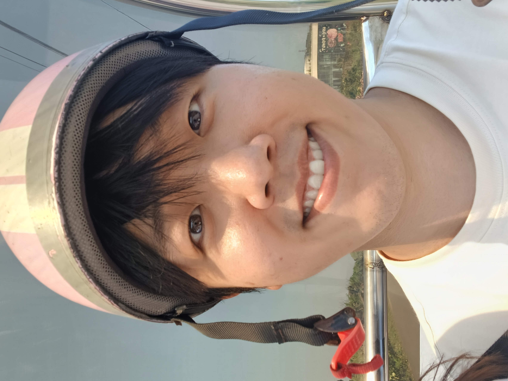

본인을 대표하는 이미지 한 장을 첨부해 주세요.

🎉 축하합니다, 우정균님! 수상의 영광을 함께 나누게 되어 기쁩니다. 🎉

## 🎙️ 우승의 기쁨을 맛본 소감을 한마디로 표현해 주세요.
사람일은 어떻게될지 모르니, 끝까지 하는게 역시 맞구나?

## 🎙️ 팀의 이야기를 들려주세요.
- 팀장님이 훌룡한분들만 어떻게 아시고 쏙쏙 뽑아, 다들 처음보는 상태로 만났습니다.
언어장애를 갖고있는 아이들을 새싹으로 비유하여, 이 친구들을 훌룡하게 키워내자! 라는 뜻으로 '농부들'이란 팀명을 짓게되었습니다.
제주도에서 와서, 교통비가 꽤 들었지만, PM님이 교통비 뽕 뽑게해주겠다는 말을 믿고 열심히 했습니다.

  ## 🎙️ 이번 성과의 비결은 무엇이라고 생각하시나요?
- 1. 탄탄한 기술스택 : github action을통한 빠른 배포로, 많은 시도를 해볼 수 있었습니다.
2. 서비스분석 : 기존 서비스와의 차별점을 상세히 분석한 것이 유효했던 것 같습니다.

## 🎙️ 대회 기간 중 특별히 기억에 남는 순간이 있다면 공유해 주세요.
- 모두들 수상을 기대하고있지 않았습니다 ㅋㅋ 밤샘작업으로인해 다들 지쳐 쓰러져있던 순간, 수상소식을 듣고 엄청난 도파민을 느꼈던 기억이..ㅋㅋ

## 🎙️ 데이터 분석이나 학습 과정에서의 나만의 비법이 있다면요?
- 구글과 gpt와 함께라면, 불가능이란 없다. 신의 어깨에 올라타면 불가능이란 없다.

## 🎙️ 수상을 기념하여 빌 수 있는 한 가지 소원이 있다면?
- 새싹해커톤 수상으로 구글 입사?!

## 🎙️ 앞으로의 목표와 꿈을 말씀해 주세요.
- 앞으로 생성형 AI를 잘 활용해서, 시대에 뒤쳐지지 않은 엔지니어가 되고 싶습니다.
